# Notes on submission (15 points)

## Front matter

Due: Saturday, April 23, 2020 at 9:00am Central

Submit to <https://classroom.github.com/a/yOcbNjw->

The problem set is worth 100 points total.

This submission is my work alone and complies with the 30535 integrity
policy.

Add your initials to indicate your agreement: **KEZG**

Add names of anyone you discussed this problem set with: \*\*\_\_\*\*

Late coins used this pset: 0. Late coins left after submission: X.

We use (\*) to indicate a problem that we think might be time consuming.

Notes on submission (15 points):

-   Name your submission files skills\_ps\_3.Rmd and skills\_ps\_3.pdf.

-   Your code should adhere to the style guide. (styler is your friend.)

-   Knit your RmD to PDF and submit via Gradescope.

-   Assign the correct page number to the question number on gradescope
    to help the grading process.

-   The PDF should not be more than 25 pages, use head() and re-size
    figures when appropriate.

# Exploratory Data Analysis (25 points)

## EDA: Exploring variation

**1. Using the diamonds dataset, explore the distribution of price.**

    ggplot(diamonds) + 
      geom_bar(aes(x = price)) +
      labs(x = "Price of diamonds", y = "Count") +
      xlim(0, 20000) +
      ggtitle("Distribution of Price") +
      theme(plot.title = element_text(hjust = 0.5))

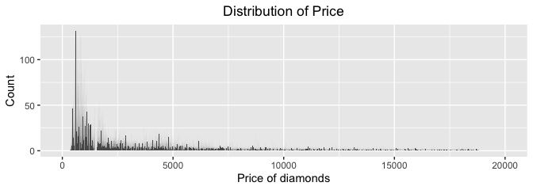

**a. Describe the overall pattern. Does it fit your expectations?**

From the previus chart, we can see that there are many spikes in prices.
The distribution is right skewed, that is, there is a greater number of
diamond prices with a value less than 5,000. The distribution is not
what I expected, since I expected that the price of diamonds would be
clustered in the highest values of the histogram.

Likewise, we can see from the following graph that the prices are
conglomerated in values less than $1400.

    ggplot(diamonds) + 
      geom_freqpoly(aes(x = price), binwidth = 20) +
      labs(x = "Price of diamonds", y = "Count") +
      xlim(500, 10000) +
      ggtitle("Distribution of Price") +
      theme(plot.title = element_text(hjust = 0.5))

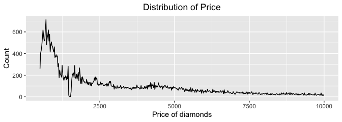

**b. Do you discover anything unusual or surprising? (Hint: Carefully
think about the binwidth and make sure you try a wide range of
values.)**

    ggplot(filter(diamonds, price < 2000 & price > 1400)) + 
      geom_histogram(aes(x = price), binwidth = 5) +
      labs(x = "Price of diamonds", y = "Count") +
      ggtitle("Distribution of Price") +
      theme(plot.title = element_text(hjust = 0.5))

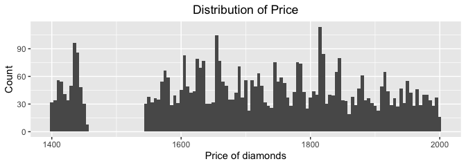

The unusual fact of this data set is that there are no values between
1454 and 1546. After the price cluster reaches zero, the next highest
cluster is in the range of 1,550 to 2,500.

    ggplot(diamonds) + 
      geom_freqpoly(aes(x = price), binwidth = 15) +
      labs(x = "Price of diamonds", y = "Count") +
      xlim(1550, 10000) +
      ggtitle("Distribution of Price") +
      theme(plot.title = element_text(hjust = 0.5))

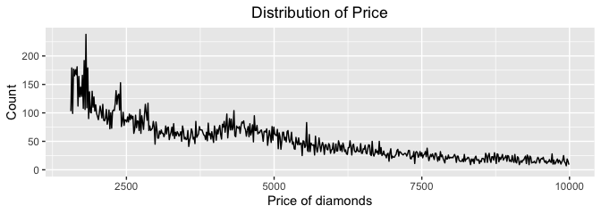

**2. Explore the distribution of carat.**

    ggplot(diamonds) + 
      geom_bar(aes(x = carat)) +
      labs(x = "Carat", y = "Count") +
      ggtitle("Distribution of Carat") +
      theme(plot.title = element_text(hjust = 0.5))

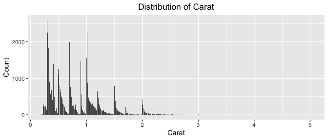

**a. Describe the overall pattern. Does it fit your expectation given
what you saw in prices?**

I would expect the carat distribution to have the same pattern as the
price distribution. However, this is not quite so. Given that there are
more diamonds sold at a lower price (right skewed), one would expect
there to be a larger demand or supply at the lower carat, but this is
true as we see that the graph has different peaks along the board. We
are facing a multimodal distribution, since it presents several peaks
followed by a significant decrease in the data.

    ggplot(diamonds) + 
      geom_freqpoly(aes(x = carat), binwidth = 0.02) +
      labs(x = "Carat", y = "Count") +
      ggtitle("Distribution of Carat (zooming in)") +
      theme(plot.title = element_text(hjust = 0.5)) +
      xlim(0.2,2.25)

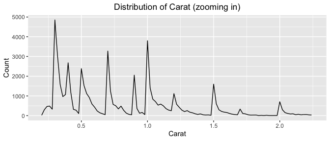

Also, in addition to seeing prominent peaks on the chart, outliers can
be seen.

    ggplot(diamonds) + 
      geom_bar(aes(x = carat)) +
      labs(x = "Carat", y = "Count") +
      ggtitle("Outliers of Carat") +
      theme(plot.title = element_text(hjust = 0.5)) +
      xlim(3.25,5.1)

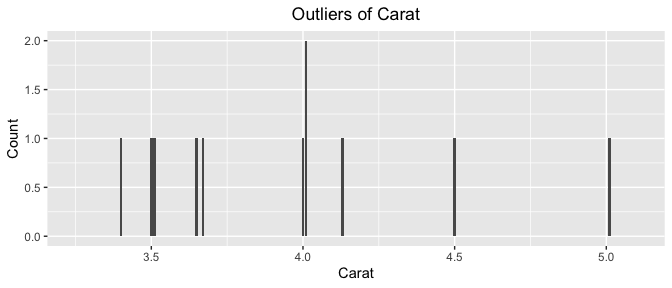

**b. How many diamonds are 0.99 carat? How many are 1 carat? What do you
think is the cause of the difference (feel free to make a plot to
support your argument)?**

-   Number of Diamonds of 0.99 carat and 1 carat:

<!-- -->

    diamonds %>%
      filter(carat == 0.99 | carat == 1) %>%
      count(carat)

    ## # A tibble: 2 × 2
    ##   carat     n
    ##   <dbl> <int>
    ## 1  0.99    23
    ## 2  1     1558

There are 23 diamonds of 0.99 carats and 1558 diamonds of 1.00 carats.

-   Plots:

From the following graphs we can see that manufacturing or selling 1.00
carat diamonds brings much more economic benefits in any cut compared to
selling 0.99 carat. Therefore, there are more 1 carat diamonds
manufactured than 0.99 carat diamonds.

    diamonds_filter <- diamonds %>%
      filter(carat == 0.99 | carat == 1)

    ggplot(diamonds_filter) + 
      geom_histogram(aes(x = price)) +
      labs(x = "Price", y = "Count") +
      ggtitle("Price of 0.99 vs 1.00 Carat") +
      theme(plot.title = element_text(hjust = 0.5)) +
      facet_wrap(~ carat)

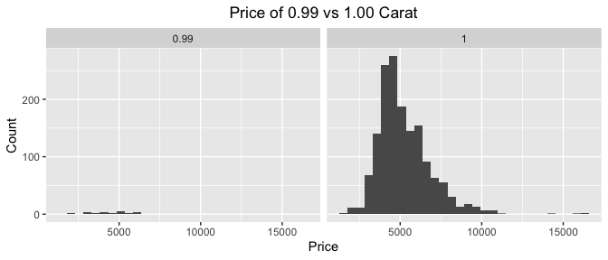

    ggplot(diamonds_filter, aes(x = cut, y = price)) + 
      geom_boxplot() +
      stat_boxplot(
        geom = "errorbar", # Error bars
        width = 0.25
      ) +
      ggtitle("Price of 0.99 vs 1.00 Carat") +
      theme(plot.title = element_text(hjust = 0.5)) +
      facet_wrap(~ carat)

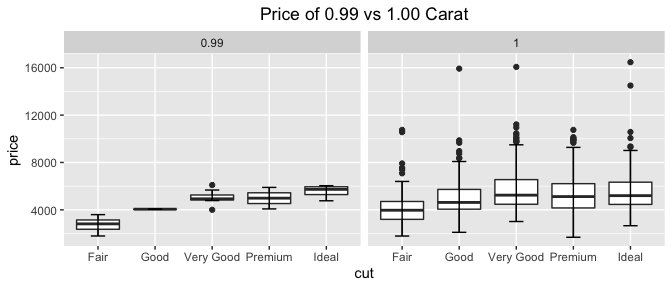

**3. Compare and contrast + coord\_cartesian() vs + xlim() or + ylim()
when zooming in on a histogram for carat. What happens if you leave
binwidth at its default value and zoom in further and further?**

-   Leaving binwidth at its default value and zoom in further using
    xlim()

<!-- -->

     ggplot(diamonds) + 
      geom_histogram(aes(x = carat)) +
      labs(x = "Carat", y = "Count") +
      ggtitle("Distribution of Carat using xlim") + 
      theme(plot.title = element_text(hjust = 0.5)) + 
      xlim(1,1.5)

    ## `stat_bin()` using `bins = 30`. Pick better value with `binwidth`.

    ## Warning: Removed 40322 rows containing non-finite values (stat_bin).

    ## Warning: Removed 2 rows containing missing values (geom_bar).

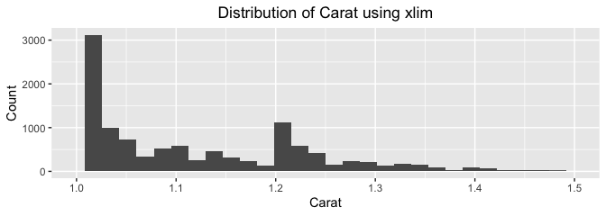

-   Leaving binwidth at its default value and zoom in further using
    coord\_cartesian

<!-- -->

    ggplot(diamonds) + 
      geom_histogram(aes(x = carat)) +
      labs(x = "Carat", y = "Count") +
      ggtitle("Distribution of Carat using coord_cartesian") +
      theme(plot.title = element_text(hjust = 0.5)) + 
      coord_cartesian( xlim = c(1,1.5))

    ## `stat_bin()` using `bins = 30`. Pick better value with `binwidth`.

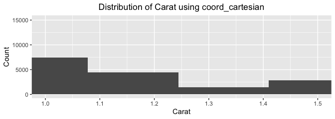

-   Leaving binwidth at its default value and zoom in further and
    further using coord\_cartesian

<!-- -->

    ggplot(diamonds) + 
      geom_histogram(aes(x = carat)) +
      labs(x = "Carat", y = "Count") +
      ggtitle("Distribution of Carat using coord_cartesian") +
      theme(plot.title = element_text(hjust = 0.5)) + 
      coord_cartesian( xlim = c(1.2,1.5))

    ## `stat_bin()` using `bins = 30`. Pick better value with `binwidth`.

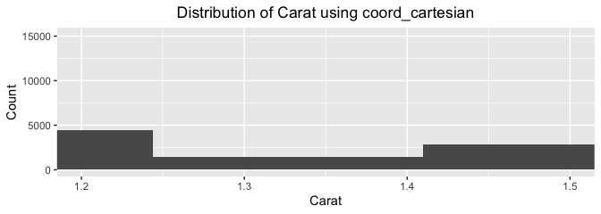

When using xlim, a message occurs stating that certain rows are being
eliminated because they are not inside the axis limitations, i.e. some
values are being lost. Also, is just after filtering the xlim, that the
geom is calculated.

While no data is deleted when using coord\_cartesian, the bins are
calculated using the original geom because we are zooming in the data
after calculating the geoms. As a result, the two graphs appear to be
distinct.

-   Changing the default binwidth

<!-- -->

    ggplot(data = diamonds, aes(x = carat)) + 
      geom_histogram(binwidth = 0.01) +
      labs(x = "Carat", y = "Count") +
      ggtitle("Distribution of Carat with a small binwidth ") +
      theme(plot.title = element_text(hjust = 0.5)) + 
      coord_cartesian(xlim = c(1.0,1.5))

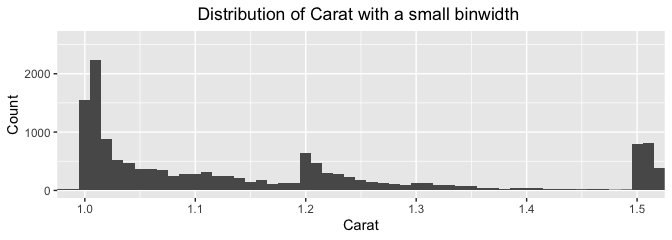

Also, when we leave binwidth at its default value, the data is
aggregated by bins, leading data to display in the histogram in an
accumulating manner, regardless of whether we use coord cartesian or
xlim. We’re altering the binwidth default in the graph above, and data
becomes less and less aggregated as the binwidth becomes smaller.

## EDA: Navigating NAs

**1. What happens to missing values in a histogram? What happens to
missing values in a bar chart? Why is there a difference? Create plots
supporting your response.**

-   We modify the diamonds dataframe to inserted NA’s:

<!-- -->

    diamonds %>% 
      mutate(y = ifelse(y < 6 | y > 20, NA, y)) %>% 
      ggplot() + 
      geom_histogram(aes(x = y))

    ## `stat_bin()` using `bins = 30`. Pick better value with `binwidth`.

    ## Warning: Removed 31632 rows containing non-finite values (stat_bin).

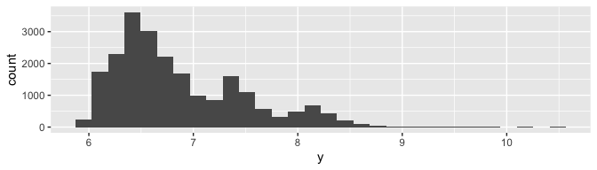

-   We modify the diamonds dataframe to have characters:

<!-- -->

    diamonds$cut <- as.character(diamonds$cut)

    diamonds %>% 
      mutate(cut = ifelse(cut == "Ideal", NA, cut)) %>% 
      ggplot() + 
      geom_bar(aes(x = cut))

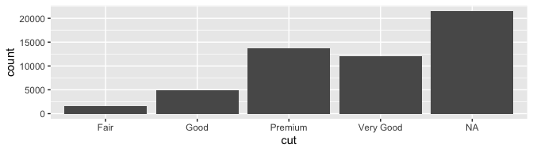

In a histogram NA values are removed, since they cannot be represented
(they do not have a value).  
On the other hand, in the bar chart, NA is a category that can be
counted.

**2. What does na.rm = TRUE do in mean() and sum()? **

NA values cannot be included in calculations as they do not represent
actual values, so if we try to average or sum a column that has NA
values, the result will be NA. Therefore, the na.rm function acts as a
logical parameter that removes (TRUE) or not (FALSE) the NA values, in
other words, it excludes missing values when calculating descriptive
statistics.

# Exploratory Data Analysis: Covariation

## Diamonds (40 points)

**1.Looking at the table below it appears that fair is nearly the
highest price cut of diamond and ideal the worst cut. But there is an
omitted variable problem!**

    diamonds %>%
      group_by(cut)  %>%
      summarise(mean = mean(price)) %>%
      arrange(desc(mean))

    ## # A tibble: 5 × 2
    ##   cut        mean
    ##   <chr>     <dbl>
    ## 1 Premium   4584.
    ## 2 Fair      4359.
    ## 3 Very Good 3982.
    ## 4 Good      3929.
    ## 5 Ideal     3458.

**For parts a. and b., please include plots along with your response.**

**a. What variable in the diamonds dataset is most important for
predicting the price of a diamond?**

-   We are going to perform a regression to give us an idea of the
    correlation of variables:

<!-- -->

    summary(lm(price ~ ., data = diamonds))

    ## 
    ## Call:
    ## lm(formula = price ~ ., data = diamonds)
    ## 
    ## Residuals:
    ##      Min       1Q   Median       3Q      Max 
    ## -21376.0   -592.4   -183.5    376.4  10694.2 
    ## 
    ## Coefficients:
    ##               Estimate Std. Error  t value Pr(>|t|)    
    ## (Intercept)   5173.444    405.136   12.770  < 2e-16 ***
    ## carat        11256.978     48.628  231.494  < 2e-16 ***
    ## cutGood        579.751     33.592   17.259  < 2e-16 ***
    ## cutIdeal       832.912     33.407   24.932  < 2e-16 ***
    ## cutPremium     762.144     32.228   23.649  < 2e-16 ***
    ## cutVery Good   726.783     32.241   22.542  < 2e-16 ***
    ## color.L      -1952.160     17.342 -112.570  < 2e-16 ***
    ## color.Q       -672.054     15.777  -42.597  < 2e-16 ***
    ## color.C       -165.283     14.725  -11.225  < 2e-16 ***
    ## color^4         38.195     13.527    2.824  0.00475 ** 
    ## color^5        -95.793     12.776   -7.498 6.59e-14 ***
    ## color^6        -48.466     11.614   -4.173 3.01e-05 ***
    ## clarity.L     4097.431     30.259  135.414  < 2e-16 ***
    ## clarity.Q    -1925.004     28.227  -68.197  < 2e-16 ***
    ## clarity.C      982.205     24.152   40.668  < 2e-16 ***
    ## clarity^4     -364.918     19.285  -18.922  < 2e-16 ***
    ## clarity^5      233.563     15.752   14.828  < 2e-16 ***
    ## clarity^6        6.883     13.715    0.502  0.61575    
    ## clarity^7       90.640     12.103    7.489 7.06e-14 ***
    ## depth          -63.806      4.535  -14.071  < 2e-16 ***
    ## table          -26.474      2.912   -9.092  < 2e-16 ***
    ## x            -1008.261     32.898  -30.648  < 2e-16 ***
    ## y                9.609     19.333    0.497  0.61918    
    ## z              -50.119     33.486   -1.497  0.13448    
    ## ---
    ## Signif. codes:  0 '***' 0.001 '**' 0.01 '*' 0.05 '.' 0.1 ' ' 1
    ## 
    ## Residual standard error: 1130 on 53916 degrees of freedom
    ## Multiple R-squared:  0.9198, Adjusted R-squared:  0.9198 
    ## F-statistic: 2.688e+04 on 23 and 53916 DF,  p-value: < 2.2e-16

From the regression, we can see that the variable “carat” is the one
that explains the variation in price to a greater extent. This statement
will be verified in the following plots that I will make, when I explore
the relationship with other variables of the data.

-   Price and Carat

From the two graphs below we can see a positive relationship between
carat and price. As the carat is higher, the price is higher.

    ggplot(diamonds) + 
      geom_point(aes(x = carat, y = price, color = clarity)) +
      ggtitle("Price and Carat") +
      theme(plot.title = element_text(hjust = 0.5))

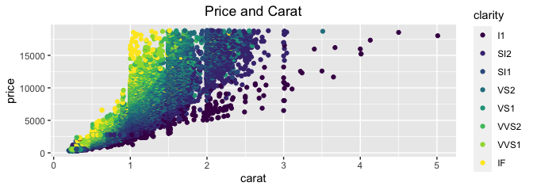

    ggplot(diamonds, aes(x = carat, y = price)) + 
      geom_boxplot(mapping = aes(group = cut_width(carat, 0.2))) +
      ggtitle("Price and Carat") +
      theme(plot.title = element_text(hjust = 0.5))

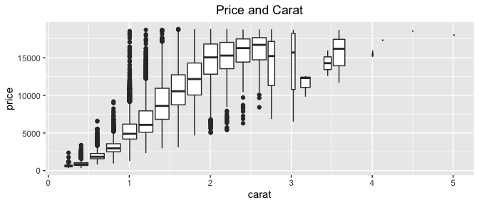

-   Price and Clarity: From worst to best : I1, SI2, SI1, VS2, VS1,
    VVS2, VVS1, IF

Regarding price and clarity, we see a negative relationship: as the
clarity is better, the price is lower

    ggplot(diamonds, aes(x = clarity, y = price)) + 
      geom_boxplot() +
      stat_boxplot(
        geom = "errorbar", # Error bars
        width = 0.25
      ) +
      ggtitle("Price and Clarity") +
      theme(plot.title = element_text(hjust = 0.5))

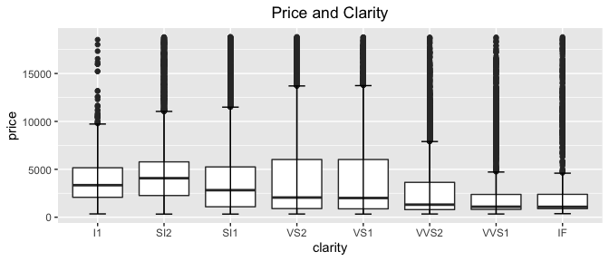

-   Price and length (x variable)

With respect to the price and x (length) we appreciate a positive
relationship. However, we can conclude that all the variables like
length (x), width (y), depth (z), depth and table are contained in the
variable “carat” which measures the weight of the diamond.

    ggplot(diamonds) + 
      geom_point(aes(x = x, y = price)) +
      ggtitle("Price and Length") +
      theme(plot.title = element_text(hjust = 0.5))

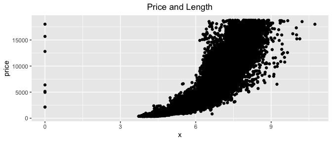

    ggplot(diamonds, aes(x = x, y = price)) + 
      geom_boxplot(mapping = aes(group = cut_width(x, 0.2)))  +
      ggtitle("Price and Length") +
      theme(plot.title = element_text(hjust = 0.5))

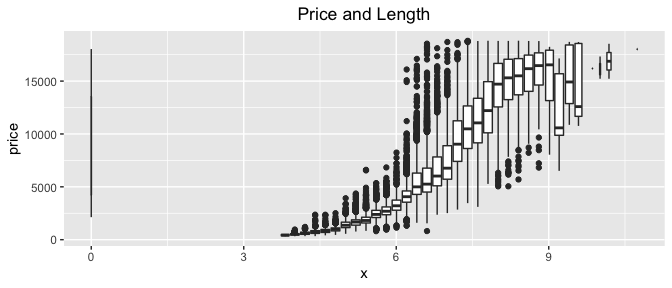

-   Price and Color: from D (best) to J (worst)

As with the “clarity” variable, we can observe a negative relationship
between price and color.

    ggplot(diamonds, aes(x = color, y = price)) + 
      geom_boxplot() +
      stat_boxplot(
        geom = "errorbar", # Error bars
        width = 0.25
      )  +
      ggtitle("Price and Color") +
      theme(plot.title = element_text(hjust = 0.5))

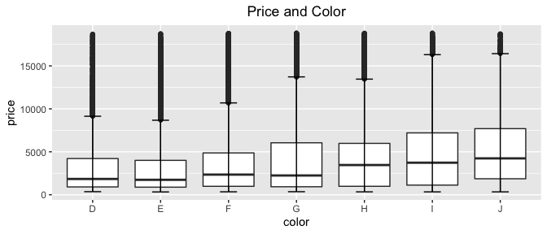

Of all the variables analyzed, we can see that the “carat” variable
correlates more clearly with the “price” variable, that is, as the carat
varies, there is a greater variation in the price. This conclusion is
also supported by the regression performed.

**b. How is that variable correlated with cut?**

Between “carat” and “cut” there is a negative relationship, except for
the “Premium” category of the cut variable. Leaving aside the mentioned
category, the better the cut, the lower the carat.

    diamonds$cut <- factor(diamonds$cut, 
                              levels = c("Fair", "Good", "Very Good", "Premium", "Ideal"))

    ggplot(diamonds, aes(x = cut, y = carat)) + 
      geom_boxplot() +
      stat_boxplot(
        geom = "errorbar", # Error bars
        width = 0.25
      ) +
      ggtitle("Carat and Cut") +
      theme(plot.title = element_text(hjust = 0.5))

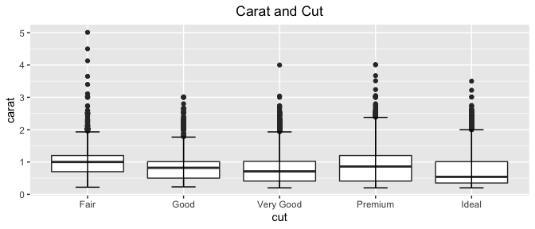

**c. Explain why the table above is misleading.**

    diamonds %>%
      group_by(cut) %>%
      summarise(mean_price = mean(price), mean_carat = mean(carat)) %>%
      arrange(desc(mean_carat))

    ## # A tibble: 5 × 3
    ##   cut       mean_price mean_carat
    ##   <fct>          <dbl>      <dbl>
    ## 1 Fair           4359.      1.05 
    ## 2 Premium        4584.      0.892
    ## 3 Good           3929.      0.849
    ## 4 Very Good      3982.      0.806
    ## 5 Ideal          3458.      0.703

The table is deceptive since it does not include all of the attributes
that must be considered when determining the diamond’s price. We’ve
previously demonstrated that the carat accounts for a considerable
portion of the range in diamond pricing. For example, the “ideal”
diamond (the best cut) has a smaller average carat, which explains why
it costs less (there are probably only small diamonds with ideal cut).
In addition, the “Premium” cut has the greatest price as well as the
largest average carat.

On the other hand, we discovered that other factors, such as color and
clarity, are associated to pricing.

**2. After recreating the two categorical variable dataframe in 7.5.2
from the textbook, adjust it to more clearly show the distribution of
cut within colour.**

-   Graph from the text book:

<!-- -->

    diamonds %>% 
      count(color, cut) %>%  
      ggplot(mapping = aes(x = color, y = cut)) +
        geom_tile(mapping = aes(fill = n))

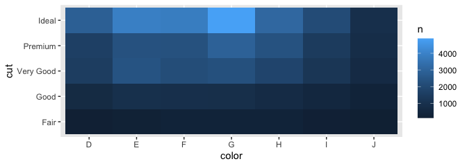

-   Adjusting to show more clearly the distribution of cut within color:

The number of repetitions of cuts in colors does not clearly show the
distribution. Therefore, we are going to use the ratio of cuts for each
color (total number of cuts per color divided by the total number of
cuts in that color).

    diamonds %>%
      count(color, cut) %>%
      group_by(color) %>%
      mutate(prop_porcentage = (n / sum(n))*100) %>% #we are multiplying by 100 to have porcentage
      ggplot(mapping = aes(x = color, y = cut)) +
      geom_tile(mapping = aes(fill = prop_porcentage)) +
      ggtitle("Distribution of cut within color") +
      theme(plot.title = element_text(hjust = 0.5))

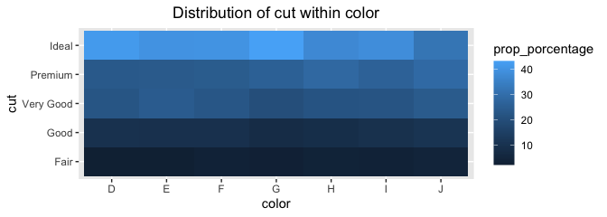

**a. Which cut is most common in every color category?**

The “Ideal” color is more common in each category of the color variable.
As we can see in the graph, the “Ideal” cut represents approximately 40%
of the total cuts for all colors.

**b. Repeat the exercise again to show distribution of colour within
cut.**

Now, let’s group by cut:

    diamonds %>%
      count(color, cut) %>%
      group_by(cut) %>%
      mutate(prop_porcentage = n / sum(n)*100) %>%
      ggplot(mapping = aes(x = color, y = cut)) +
      geom_tile(mapping = aes(fill = prop_porcentage)) +
      ggtitle("Distribution of colour within cut") +
      theme(plot.title = element_text(hjust = 0.5))

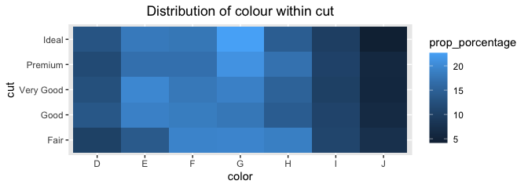

From the graph, we can see that color G is the one that is repeated the
most within all the cut categories (it has the clearest grids).

**c. Using the dataframe you just produced as input, reproduce the
following graph.**

    #Using the data frame from last plot
    diamond2 <- diamonds %>%
      count(color, cut) %>%
      group_by(cut) %>%
      mutate(prop = n / sum(n))

    ggplot(diamond2, aes(x = color, y = prop)) +
      geom_bar(stat = "identity") +
      facet_wrap(~cut)

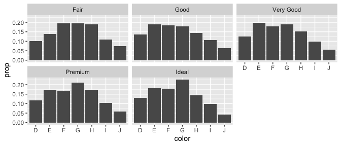

**3. Instead of summarising the conditional distribution of price by
carat size with a boxplot (see 7.5.3), you could use a frequency
polygon, where you map binned carat data to the color aesthetic.**

-   Graph from the book:

<!-- -->

    ggplot(data = diamonds, mapping = aes(x = carat, y = price)) + 
      geom_boxplot(mapping = aes(group = cut_width(carat, 0.1)))

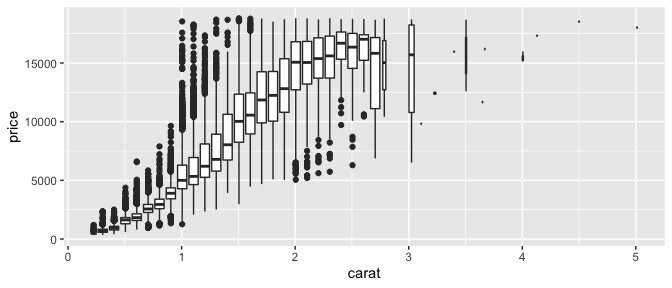

**a. Make a frequency polygon using cut\_width() and another using
cut\_number(). Adjust the parameters until you think both graphs are
most useful.**

By using cut\_number we choose the number of bins that the graph should
fetch. In this sense, in this case, five bins have been chosen since it
is better perceived by sight, and contains the necessary information.

    ggplot(diamonds, aes(x = price, color = cut_number(carat, 5))) + 
        geom_freqpoly()

    ## `stat_bin()` using `bins = 30`. Pick better value with `binwidth`.

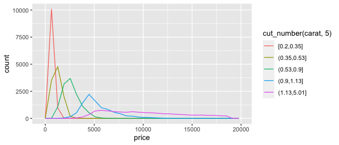

On the other hand, when we use cut\_width, we determine the width and R
performs the calculation of how many containers correspond. By choosing
a larger width number, very little information is visible (only one
frequency is visible); even though the width of 0.5 creates multiple
clusters, only three are correctly perceived on the graph, so it is
considered to present valuable information.

    ggplot(diamonds, aes(x = price, color = cut_width(carat, 0.5, boundary = 0))) + 
        geom_freqpoly()

    ## `stat_bin()` using `bins = 30`. Pick better value with `binwidth`.

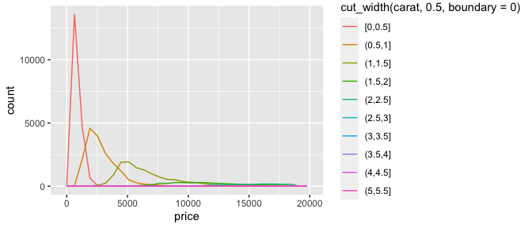

    # we put boundary = 0 to ensure the first bin starts with 0

**b. For this application (carat and price), what are the pros and cons
of cut\_width() relative to cut\_number()?**

Since the data is skewed to the right in this application, the downside
of cut\_width() is that it’s hard to set a width that can display enough
information in the rightmost bins. On the other hand, the advantage is
that the intervals of each of the bits is the same, and can be quickly
identified, unlike the cut\_number function.

**4. Visualize the distribution of carat, partitioned by price. The
graph should have a clear story accentuated by a descriptive title.**

    ggplot(diamonds, aes(x = cut_number(price/100, 10), y = carat)) + 
      geom_boxplot() +
      stat_boxplot(
        geom = "errorbar", # Error bars
        width = 0.25
      )  +
      ggtitle("Distribution of carat partitioned by price") +
      theme(plot.title = element_text(hjust = 0.5)) +
      labs(y = "Carat", x = "Price in hundreds of dollars") +
      coord_flip()

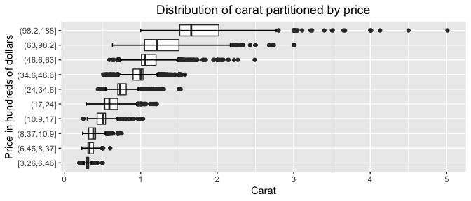

    ggplot(diamonds, aes(x = carat, color = cut_number(price / 100, 5))) +
      geom_freqpoly() +
      ggtitle("Distribution of carat partitioned by price") +
      theme(plot.title = element_text(hjust = 0.5)) +
      labs(y = "Count", x = "Carat", color = "Price in hundreds of dollars")

    ## `stat_bin()` using `bins = 30`. Pick better value with `binwidth`.

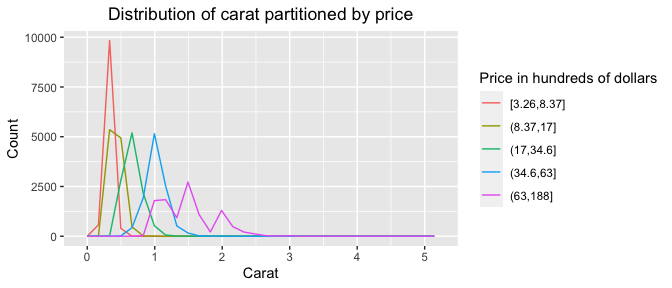

**5. How does the price distribution of very large diamonds (as measured
by carat) compare to small diamonds? Is it as you expect, or does it
surprise you? Why?**

The variance in the distribution of bigger diamonds is significantly
greater than the variation in the distribution of smaller diamonds, as
can be seen in both graphs. In the first graph, for example, we can see
that the box plot grows larger as the carat increases, and there are
also more outliers. We can observe from graph 2 that smaller diamonds
have a narrower bin. I’m not surprised, because I would anticipate
people to seek out bigger diamonds. As a result, it’s more likely that
there will be a bigger supply (number) of big diamonds, and that their
qualities will be more diverse in relation to them (affecting price).

We’ve seen in earlier questions that pricing is influenced by factors
like clarity, cut, and color. As a result, having a larger number of
huge diamonds increases the likelihood of a wider range of
characteristics and, ultimately, a higher variation in price.

**6. So far we’ve focused on visualizing covariation of two variables.
We can add a third dimension in several ways. For example, we could map
to a third aesthetic or add facets. Combine two of the techniques you’ve
learned in this class to visualise the combined distribution of cut,
carat, and price.**

    ggplot(diamonds, aes(x = carat, color = cut_number(price / 100, 5))) +
      geom_freqpoly() +
      ggtitle("Distribution of carat by cut partitioned by price") +
      theme(plot.title = element_text(hjust = 0.5)) +
      labs(y = "Count", x = "Carat", color = "Price in hundreds of dollars") +
      facet_wrap(~ cut)

    ## `stat_bin()` using `bins = 30`. Pick better value with `binwidth`.

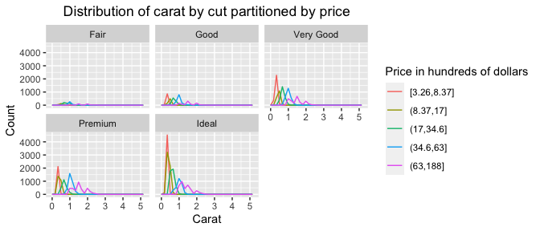

    ggplot(diamonds, aes(x = cut_number(price/100, 5), y = carat)) + 
      geom_boxplot() +
      stat_boxplot(
        geom = "errorbar", # Error bars
        width = 0.25
      )  +
      ggtitle("Distribution of carat by cut partitioned by price") +
      theme(plot.title = element_text(hjust = 0.5)) +
      labs(y = "Carat", x = "Price in hundreds of dollars") +
      coord_flip() +
      facet_wrap(~ cut)

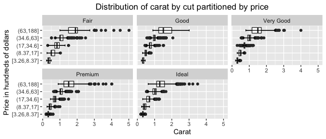

    ggplot(diamonds) + 
      geom_hex(aes(x = carat, y = price)) +
      facet_wrap(~ cut) +
      ggtitle("Distribution of carat by cut partitioned by price") +
      theme(plot.title = element_text(hjust = 0.5))

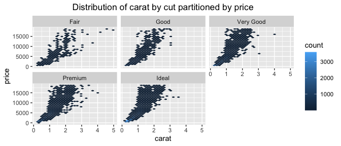

**7. Two dimensional plots reveal outliers that are not visible in one
dimensional plots. For example, some points in the plot below have an
unusual combination of x and y values, which makes the points outliers
even though their x and y values appear normal when examined separately.
Consider the two plots below **

    ggplot(data = diamonds) +
    geom_point(mapping = aes(x = x, y = y)) +
    coord_cartesian(xlim = c(4, 11), ylim = c(4, 11))

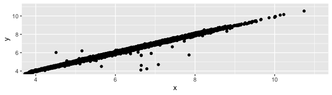

    ggplot(data = diamonds) +
    geom_bin2d(mapping = aes(x = x, y = y)) +
    coord_cartesian(xlim = c(4, 11), ylim = c(4, 11))

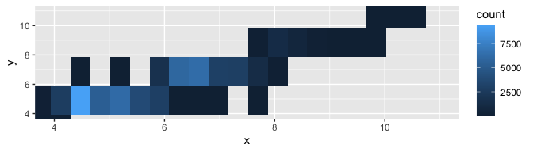

**Which geom is better for identifying outliers? Why?**

The geom\_point plot.

The first plot, geom\_point, more directly reveals the outliers of the x
and y variables. The same cannot be said of the binned plot, because it
has categorized data in bins, which does not allow the individual data
to be identified at a glance. In this sense, the last graph does not
allow to clearly establish an association between the variables and
visualize the outliers.

# Flights (10 points)

**1. In class we saw three ways other than geom\_point() to relate two
continuous variables. Use these three ways to compare scheduled
departure time and departure delay. (hint: you will need to construct
groups for geom\_boxplot() to get it to work.) What lessons stand out
from each geom choice? Are any geoms dominated, meaning that you would
never want to use them?**

    library(nycflights13)
    view(flights)

-   Using geom\_boxplot

From the boxplot, we can conclude that as a flight is scheduled later,
there is a higher average departure delay. Likewise, it can be seen that
there is less variation in the variable “dep\_delay” as the flight is
scheduled for later.

    flights %>%
      filter(dep_delay > 0) %>% # Using only delay flights (no flights that departed early)
      ggplot(aes(x = cut_number(dep_delay / 10, 10), y = sched_dep_time)) +
      geom_boxplot() +
      stat_boxplot(
        geom = "errorbar", # Error bars
        width = 0.25
      ) +
      ggtitle("Comparing scheduled departure time and departure delay") +
      theme(plot.title = element_text(hjust = 0.5)) +
      labs(y = "", x = "Departure delay divided by 10")

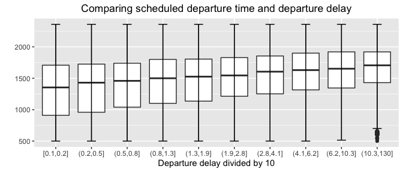

    library(binsreg)

-   Using binscatter

This graph shows us in a more direct way the relationship between the
scheduled time of the flight and its delay. In this way, we can
establish that both variables have a positive correlation, the latest
the flight time is, the greater the probability of delay.

    # Using only delay flights (no flights that departed early)  
    flight1 <- flights %>%
      filter(dep_delay > 0)

    binsreg(flight1$sched_dep_time, flight1$dep_delay, nbins = 20)

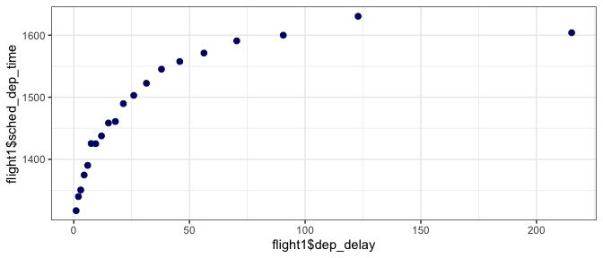

    ## Call: binsreg
    ## 
    ## Binscatter Plot
    ## Bin selection method (binsmethod)  =  User-specified
    ## Placement (binspos)                =  Quantile-spaced
    ## Derivative (deriv)                 =  0
    ## 
    ## Group (by)                         =  Full Sample
    ## Sample size (n)                    =  128432
    ## # of distinct values (Ndist)       =  495
    ## # of clusters (Nclust)             =  NA
    ## dots, degree (p)                   =  0
    ## dots, smooth (s)                   =  0
    ## # of bins (nbins)                  =  20

-   Using geom\_hex

We could say that this third plot is the one that is dominated by the
two previous variables. This graph does not show the relationship of
variables very clearly, since the data is divided into bins, i.e. that
do not allow the data to be viewed well.

    ggplot(flights) + 
      geom_hex(aes(x = dep_delay, y = sched_dep_time))  +
      ggtitle("Comparing scheduled departure time and departure delay") +
      theme(plot.title = element_text(hjust = 0.5))  +
      labs(y = "Schedule departed time", x = "Departure delay divided by 10")

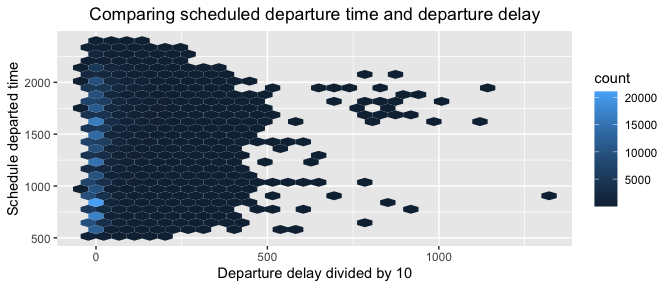

# R4DS Chapter 10 and 11 (15 points)

**1. Consider the code chunk below with three operations applied to the
data.frame called d\_f. Create a tibble with the same content and apply
these same three operations to the tibble. How do the results differ?
Why might the default data frame behaviours cause you frustration?**

    d_f <- data.frame(abc = 1, xyz = "a")
    d_f$x

    ## [1] "a"

    d_f[, "xyz"]

    ## [1] "a"

    d_f[, c("abc", "xyz")]

    ##   abc xyz
    ## 1   1   a

-Create a tibble

    tbl <- as_tibble(d_f)
    tbl$x

    ## Warning: Unknown or uninitialised column: `x`.

    ## NULL

    tbl[, "xyz"]

    ## # A tibble: 1 × 1
    ##   xyz  
    ##   <chr>
    ## 1 a

    tbl[, c("abc", "xyz")]

    ## # A tibble: 1 × 2
    ##     abc xyz  
    ##   <dbl> <chr>
    ## 1     1 a

    # This will be the same result than in the dataframe

The results differ in both the first and second application of the code.
When using the
d\_f$x function on the dataframe, the result is "a". However, with the tibble we no longer have the same answer. This difference occurs, since with the dataframe the d\_f$x
function looks for any column that begins with the letter x. The
frustrating thing is that this can cause complications in the treatment
of the data. By chance, we can take a column that does not correspond to
the one we want to work with.

To have the same result with the tibble, we would have to use tdf$xyz
for the first application of the code.

Regarding the second application, the dataframe shows the result as a
vector and not as a table. Instead, tibble returns the output as a table

**2. Write code to import a file “file.xxx” where fields are separated
with “|”?**

*we were told not to do this question*

**3. Identify what is wrong with each of the following inline CSV
files.**

-   1.  read\_csv(“a,b  n 1,2,3  n 4,5,6”)

What is wrong with this table is that only two columns “a and b” have
been created but we have data as if there were three columns. Therefore,
the value of the third column is being merged with the value of the
second column.

-   1.  read\_csv(“a,b,c  n 1,2  n 1,2,3,4”)

Similar to the previous case, the error now occurs because the third row
had four data, but only three columns “a,b and c” had been created.
Likewise, the second row only had two data and was assigned the value of
NA.

-   1.  read\_csv(“a,b n  ”1")

We get data error that a value ("“) has been quoted, as there is an
extra”". The problem is solved if you remove the quotes from the number
1.

-   1.  read\_csv(“a,b  n 1,2  na,b”)

Since the second row is made up of “a” and “b” as strings, the numbers
in the first row will also be considered as characters. Both columns are
clasified as <chr>.

-   1.  read\_csv(“a;b;3”)

The function is treating the information poured as a single column. It
does not recognize the semicolon (;), just commas. In this application,
if we remove the semicolon and replace it with the comma, the tables
will be fixed.

**4. Review the textbook to understand locale(). What do the
date\_format and time\_format options to locale() do? Figure out how to
handle dates from Latin American countries. Provide a code line of code
as an example of your understanding.**

Date\_format and time\_format set a specific format to use for the date
or time respectively. They help encapsulate the common characteristics
by locality, in this case specifically referring to time and dates. For
example, we would put the following:

-   Using date\_format:

<!-- -->

    parse_date("23/05/22", locale = locale(date_format = "%d/%m/%y"))

    ## [1] "2022-05-23"

-   Using time\_format:

<!-- -->

    parse_time("5:35 PM", locale = locale(time_format = "%H:%M %p"))

    ## 17:35:00

-   Handling dates from Latin American countries

<!-- -->

    date_names_langs()

    ##   [1] "af"  "agq" "ak"  "am"  "ar"  "as"  "asa" "az"  "bas" "be"  "bem" "bez"
    ##  [13] "bg"  "bm"  "bn"  "bo"  "br"  "brx" "bs"  "ca"  "cgg" "chr" "cs"  "cy" 
    ##  [25] "da"  "dav" "de"  "dje" "dsb" "dua" "dyo" "dz"  "ebu" "ee"  "el"  "en" 
    ##  [37] "eo"  "es"  "et"  "eu"  "ewo" "fa"  "ff"  "fi"  "fil" "fo"  "fr"  "fur"
    ##  [49] "fy"  "ga"  "gd"  "gl"  "gsw" "gu"  "guz" "gv"  "ha"  "haw" "he"  "hi" 
    ##  [61] "hr"  "hsb" "hu"  "hy"  "id"  "ig"  "ii"  "is"  "it"  "ja"  "jgo" "jmc"
    ##  [73] "ka"  "kab" "kam" "kde" "kea" "khq" "ki"  "kk"  "kkj" "kl"  "kln" "km" 
    ##  [85] "kn"  "ko"  "kok" "ks"  "ksb" "ksf" "ksh" "kw"  "ky"  "lag" "lb"  "lg" 
    ##  [97] "lkt" "ln"  "lo"  "lt"  "lu"  "luo" "luy" "lv"  "mas" "mer" "mfe" "mg" 
    ## [109] "mgh" "mgo" "mk"  "ml"  "mn"  "mr"  "ms"  "mt"  "mua" "my"  "naq" "nb" 
    ## [121] "nd"  "ne"  "nl"  "nmg" "nn"  "nnh" "nus" "nyn" "om"  "or"  "os"  "pa" 
    ## [133] "pl"  "ps"  "pt"  "qu"  "rm"  "rn"  "ro"  "rof" "ru"  "rw"  "rwk" "sah"
    ## [145] "saq" "sbp" "se"  "seh" "ses" "sg"  "shi" "si"  "sk"  "sl"  "smn" "sn" 
    ## [157] "so"  "sq"  "sr"  "sv"  "sw"  "ta"  "te"  "teo" "th"  "ti"  "to"  "tr" 
    ## [169] "twq" "tzm" "ug"  "uk"  "ur"  "uz"  "vai" "vi"  "vun" "wae" "xog" "yav"
    ## [181] "yi"  "yo"  "zgh" "zh"  "zu"

    parse_date("5 Marzo 2022", "%d %B %Y", locale = locale("es"))

    ## [1] "2022-03-05"

**5. Generate the correct format string to parse each of the following
dates and times:**

    d1 <- "January 1, 2010"
    d2 <- "2015-Mar-07"
    d3 <- "06-Jun-2016"
    d4 <- c("August 19 (2015)", "July 1 (2015)")
    d5 <- "12/30/14" # Dec 30, 2014
    t1 <- "1805" # 6:05 pm
    t2 <- "11:25:10.12 PM"

-   Correct format d1:

<!-- -->

    parse_date(d1, "%B %d, %Y")

    ## [1] "2010-01-01"

-   Correct format d2:

<!-- -->

    parse_date(d2, "%Y-%b-%d")

    ## [1] "2015-03-07"

-   Correct format d3:

<!-- -->

    parse_date(d3, "%d-%b-%Y")

    ## [1] "2016-06-06"

-   Correct format d4:

<!-- -->

    parse_date(d4, "%B %d (%Y)")

    ## [1] "2015-08-19" "2015-07-01"

-   Correct format d5:

<!-- -->

    parse_date(d5, "%m/%d/%y")

    ## [1] "2014-12-30"

-   Correct format t1:

<!-- -->

    parse_time(t1, "%H%M")

    ## 18:05:00

-   Correct format t2:

<!-- -->

    parse_time(t2, "%I:%M:%OS %p")

    ## 23:25:10.12

**6. Run fwf\_empty() using readr\_example(“massey-rating.txt”).
Describe the output.**

    readr_example("massey-rating.txt") %>%
      fwf_empty()

    ## $begin
    ##  [1]  0  4  8 12 17 22 26 30 34 38 42 47 63
    ## 
    ## $end
    ##  [1]  3  7 11 15 19 25 29 33 37 41 46 59 NA
    ## 
    ## $col_names
    ##  [1] "X1"  "X2"  "X3"  "X4"  "X5"  "X6"  "X7"  "X8"  "X9"  "X10" "X11" "X12"
    ## [13] "X13"

As an alternative to using parse, the fwf\_empty function makes guesses
based on the positions of empty columns. In that sense, we have an
output that shows 13 column names (X1 to X13) and two additional
columns: begin and end. The data of the last mentioned variables are
ascending. We can also see that there is a missing value, which is set
to “NA”
